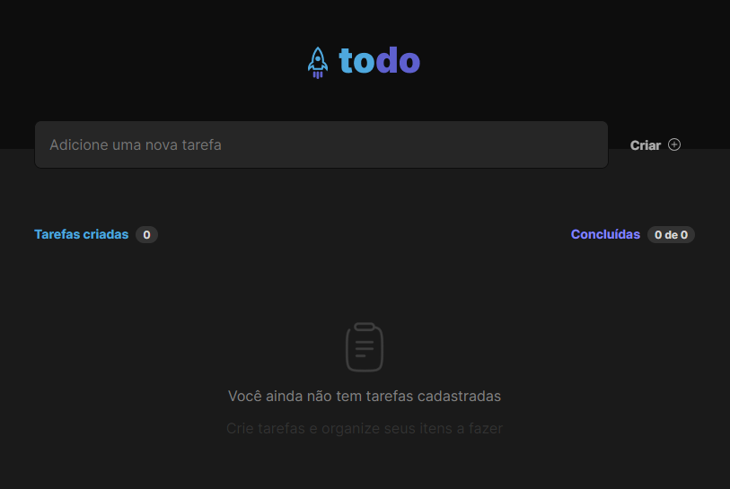

# Challenge Ignite - TO DO LIST

Primeiro desafio do Ignite da Rockeseat.


## Licença


## Preview

<p align="center">
  
</p>

## 🔗 Deploy

[To do list](https://challenge-todo-list-pi.vercel.app/)


## Create new project

Install my-project with npm

```bash
  npm create vite@latest
  cd my-app
```
Start project
```bash
  npm run dev
```
    
## Acknowledgements

 - [Rocketseat Ignite](https://lp.rocketseat.com.br/ignite)
 - [Diego Fernandes](https://www.instagram.com/dieegosf/)


## Tech Stack

**Client:** React, Vite, 


